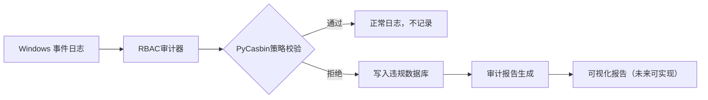

# SecuLog——基于Windows系统日志实现安全审查

## 一、项目背景&目标：

这是我大二专业课的课程作业，花了半天学习然后写完。它是基于 Windows 系统日志，实现身份鉴别、RBAC 访问控制、安全审计的轻量级安全监控工具，并可以生成审计报告。

## 二、核心功能模块：

| **功能模块**      | **实现效果**                                                 |
| ----------------- | ------------------------------------------------------------ |
| **身份鉴别**      | 根据 Windows 用户名映射角色（管理员 / 访客 / 受限用户），支持在policy.csv里自定义角色映射表 |
| **RBAC 访问控制** | 基于 PyCasbin 实现角色 - 权限动态绑定，支持文件路径、操作类型（读 / 写 / 删除）的细粒度控制 |
| **安全审计**      | 通过事件ID实时监控系统安全日志，使用SQLite存储数据，支持按时间范围查询违规记录，生成审计报告 |

项目架构：

```markdown
os_security_auditor/
├── main.py                  # 程序的主入口，负责协调各个模块的运行
├── rbac_auditor.py          # 核心的RBAC审计器，实现用户角色映射和权限校验
├── database.py              # 数据库操作模块，用于管理审计记录
├── report_generator.py      # 生成安全审计报告
├── config/                  # 配置文件目录
│   ├── model.conf           # Casbin的模型配置文件
│   └── policy.csv           # Casbin的策略配置文件
├── tests/                   # 单元测试目录(里面都是我中间测试用的，没啥用了属于是)
├── requirements.txt         # 项目依赖库列表
└── README.md                # 项目说明文档
```

## 三、技术架构&依赖环境：

### 1. 技术栈：



**原理：**获取事件日志，提取操作用户，时间，操作对象，比对操作的掩码确认操作；再将以上与预设比对，找出敏感操作。
在这里为了更方便展示仅检查对于示例文件的访问检查，其他操作部分ID：

| 事件 ID | 含义         | 监控目的                 |
| ------- | ------------ | ------------------------ |
| 4657    | 注册表项修改 | 检测未授权的系统配置变更 |
| 4663    | 文件访问操作 | 审计敏感文件的访问       |
| 5140    | 共享对象访问 | 监控网络共享资源的使用   |
| 4624    | 成功登录事件 | 记录用户登录行为         |
| 4625    | 失败登录事件 | 检测暴力破解尝试         |

### 2. 环境依赖：

- **系统**：Windows 10/11 **需管理员权限读取日志**

  > 注意：Windows 默认情况下不会记录所有文件操作事件，需要手动启用 **文件系统审计策略** 才能捕获这些日志。操作如下：
  >
  > 1. 以管理员权限运行powershell，运行以下指令：
  >
  >    ```bush
  >    auditpol /set /subcategory:"文件系统" /success:enable /failure:enable
  >    ```
  >
  > 2. 运行以下指令检查是否成功开启：
  >
  >    ```bush
  >    auditpol /get /subcategory:"文件系统"
  >    ```
  >
  >    和下图一致即为成功：
  >
  >    

- **Python 版本**：3.8+

- 第三方库

  ```plaintext
  casbin==1.43.0    # RBAC核心框架  
  pywin32==305      # Windows API交互  
  sqlite3          # 内置数据库（无需安装）  
  ```

   安装命令：

  ```bash
  pip install -r requirements.txt  
  ```

* 其他注意事项：
  1. 需要被审查的文件夹需要手动设置审计：
     1. **右键目标文件夹 → 属性 → 安全 → 高级 → 审计 → 添加**
        - 选择要监控的用户/组（如 `Everyone`）。
        - 勾选需要记录的操作（如 **“读取”、“写入”、“删除”**）。
        
     2. **确认权限继承**
        - 如果需要监控子文件夹，勾选 **“仅将此对象应用到…”** 或启用继承。
        
          

## 四、快速上手指南：

### 1. 部署流程图：

   ```mermaid
   graph TD  
   1[克隆代码] --> 2[配置角色映射表 rbac_auditor.py]  
   2 --> 3[配置策略文件 policy.csv]  
   3 --> 4[运行主程序 main.py]  
   4 --> 5{检查日志}  
   5 -->|违规操作| 6[数据库记录+控制台告警]  
   5 -->|正常操作| 7[日志记录]  
   ```

   ### 2. 关键配置示例：

- 角色映射表（rbac_auditor.py&policy.csv）

  * 别忘了路径里的转义字符。可以去事件查看器（shell里敲eventvwr.msc回车-windows日志-安全）里看一下自己是谁，账户名就是一会我们要匹配的

    

  ```python
  ROLE_MAP = {  
      "Administrator": "admin",    # 管理员角色  
      "Guest": "guest",            # 访客角色（仅读权限）  
      "受限用户": "blocked"         # 禁止访问敏感路径  
  }  
  
  g, Administrator, admin
  g, asakawaslegionr\18715, guest       # 为了触发警告把自己变成guest
  g, 18715, guest
  g, Guest, guest
  g, WDAGUtilityAccount, blocked
  ```

- 访问控制策略（policy.csv）

  ```
  p, admin, /system/, write    # 管理员允许写入系统目录  
  p, guest, /public/, read     # 访客仅允许读取公共目录  
  p, guest, /public/, deny     # 访客什么也不许
  ```

### 3. 启动命令：

配置好后直接运行main.py即可（需要管理员权限）

### 4. 运行结果示例：

* 输出结果：


* 数据库：

  

* 示例敏感文件：

  

  

## 五、未来的优化方向：

1. **加个界面**：做个可视化窗口，不用看代码，直接在界面上就能看到系统有没有被违规访问；
2. **运行优化：**我在测试的时候因为只运行十五秒，为了全部展示是从前往后的（否则就会出现从很前面的日志开始检查导致抓不到需要的操作）；在实际的持续运行的时候需要优化。然后需要考虑怎么运行才能占用最少的cpu工作量；
3. **自动报警**：遇到严重违规行为，自动发邮件提醒管理员，及时处理问题；
4. **云端查日志**：把日志存到云端，不管在哪台电脑，都能快速找到历史记录；
5. **更灵活的权限**：除了按角色给权限，还能根据用户所在部门、使用的 IP 地址，更灵活地控制访问权限。

## 六、项目地址&其他：

-  GitHub 仓库：[Seculog](https://github.com/AsakawaNagi/SecuLog)
- 初学水平有限，欢迎各位大佬的指点！
- 其他：
  - PyCasbin 官方文档：[https://casbin.org](https://casbin.org/)
  - Windows 事件日志开发指南：https://learn.microsoft.com/en-us/windows/win32/eventlog
  - 感谢卷王哥、香辣鸡腿堡、豆包、deep seek的大力支持
